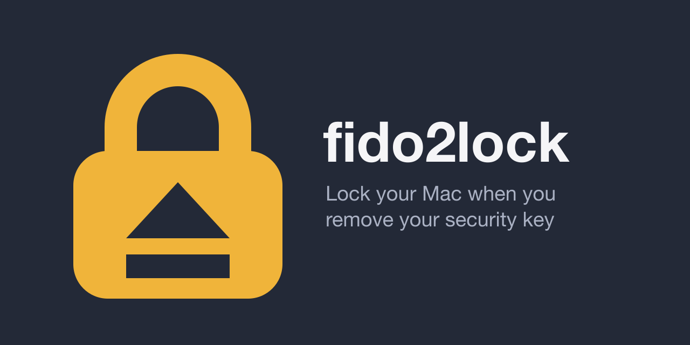

<p align="center"></p>

<p align="center">
<a href="https://github.com/BJMCox/fido2lock/actions/workflows/ci.yml"></a>
<a href="https://github.com/BJMCox/fido2lock/actions/workflows/codeql.yml"></a>
<a href="https://github.com/BJMCox/fido2lock/actions/workflows/release.yml"></a>
<a href="https://slsa.dev"></a>
<a href="https://github.com/BJMCox/fido2lock/releases/latest"></a>
<a href="https://github.com/BJMCox/fido2lock/releases/latest"></a>
<a href="LICENSE"></a>
<a href="#requirements"></a>
<a href="https://fidoalliance.org"></a>
<a href="CONTRIBUTING.md#build"></a>
<a href="CONTRIBUTING.md#build"></a>
<a href="https://github.com/BJMCox/fido2lock/security/dependabot"></a>
<a href="https://github.com/BJMCox/fido2lock/commits/main"></a>
<a href="https://github.com/BJMCox/fido2lock/issues"></a>
</p>

fido2lock is a macOS menu-bar app that locks the screen when you remove your FIDO2 security key.

Enroll the key once. While it is in, fido2lock is armed. Pull it out, and the screen locks, at once or after a delay you set. Unlock as usual, with your password or Touch ID. A key that was never inserted arms nothing, so the Mac works normally without it.

fido2lock checks each inserted key without a touch or PIN: the key proves it holds a credential that fido2lock created. It watches the IOKit registry and never opens a key exclusively, so browsers and other key tools keep working. It uses no CPU while idle.

## Requirements

- macOS 13 or later on Apple silicon
- A FIDO2 security key of any brand, for example YubiKey, Token2, or Google Titan. A PIN is optional. Keys that always require user verification cannot be checked without a touch, and Set Up refuses them.

## Install

1. Download the `.dmg` or `.pkg` from the latest release and install the app. The `.pkg` installs only `/Applications/fido2lock.app` and runs no scripts. Both are self-signed, not notarized by Apple, so macOS can refuse to open them the first time. If it does, click Done, open System Settings > Privacy & Security, and click "Open Anyway" under Security. Confirm with your password, then open the file again. macOS 15 and later no longer offer right-click > Open for this.
2. Choose "Set Up…" in the menu. Enter a label for the key and its PIN (blank if it has none), then touch the key.
3. The last panel offers "Start at Login". If you skip it, choose it later in the menu.

The enrolled keys live in `~/Library/Application Support/fido2lock/keys.toml`. The file holds labels and credential IDs, no secrets.

## Usage

The menu:

- The first line shows the state: armed and by which keys, not armed, paused, locking soon, or a problem.
- **Pause Until the Key Is Back** lets you take the key out without locking, for example to move it to another port. The lock returns when you insert an enrolled key. **Resume** ends the pause early.
- **Set Up…** enrolls the first key. **Add Security Key…** enrolls a backup key. **Check a Security Key…** shows whether the inserted key is enrolled. **Remove Security Key…** removes keys from the list.
- **Settings…** sets the lock delay: the seconds between removing a key and locking, from 0 (the default) to 60. Inserting an enrolled key before the delay ends cancels the lock. The setting lives in `~/Library/Application Support/fido2lock/config.toml`.
- **Start at Login**, **Copy Diagnostics** for bug reports (no key material), **Help…**, **About fido2lock**, and **Quit**.

For the terminal, link the command into your `PATH`:

```sh
ln -s /Applications/fido2lock.app/Contents/MacOS/fido2lock ~/.local/bin/fido2lock
```

| Command | Action |
|---|---|
| `enroll-key --label NAME` | Enroll the inserted key. Asks for the PIN (blank for none) and a touch. |
| `remove-key --label NAME [--label NAME ...]` | Remove enrolled keys. |
| `check-key` | Show whether the inserted key is enrolled, and as which label. |
| `list-keys` | List the enrolled labels. |
| `completions zsh` | Print the zsh completion script. Save it as `_fido2lock` in a folder on your `$fpath`. |
| `help` | Show the commands. |

With several keys inserted, all of them blink. Touch the one to use. This needs CTAP 2.1, which current YubiKey, Token2, and Google Titan models support. With older keys, insert only one.

## Verify a release

Each release carries SLSA Build Level 3 provenance:

```sh
gh attestation verify fido2lock-<version>.dmg --repo BJMCox/fido2lock \
  --signer-workflow BJMCox/fido2lock/.github/workflows/build.yml
shasum -a 256 -c SHA256SUMS
```

The release notes link each installer's VirusTotal scan.

## Limits

- fido2lock locks the screen. It does not log you out, encrypt anything, or stop someone who already knows your password.
- The lock uses a private macOS function, the one behind Ctrl-Cmd-Q. If a macOS update removes it, the menu says "Cannot lock the screen".
- Waking from sleep can reconnect USB devices. fido2lock waits 10 s after a wake before it acts on a removal, so a reconnect does not lock. A key taken out during sleep still locks the screen about 10 s after the wake, plus the lock delay.
- Keys connected by NFC or Bluetooth do not arm the lock.

## Upgrade and uninstall

To upgrade, quit fido2lock, install the new version, and open it.

To uninstall, uncheck "Start at Login", quit fido2lock, and run:

```sh
sudo rm -rf /Applications/fido2lock.app
sudo pkgutil --forget dev.fido2lock.pkg
rm -rf ~/Library/Application\ Support/fido2lock
```

## Build from source

See [CONTRIBUTING.md](CONTRIBUTING.md).

## License

Copyright 2026 Jessica Cox <jmcox@posteo.de>

Licensed under the [Apache License, Version 2.0](LICENSE). See [NOTICE](NOTICE).
